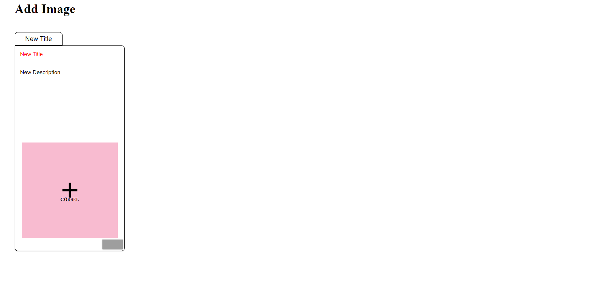
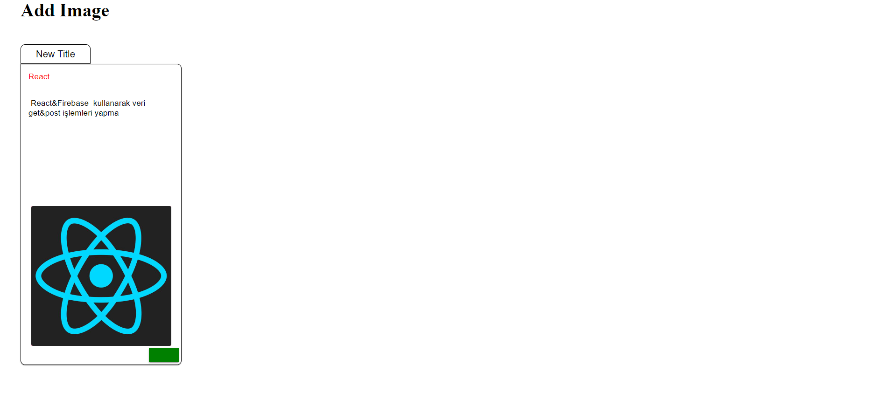
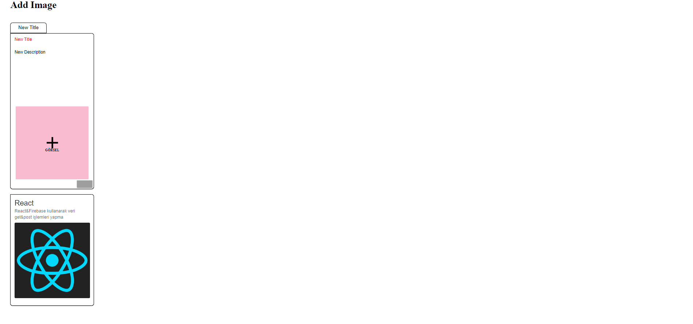
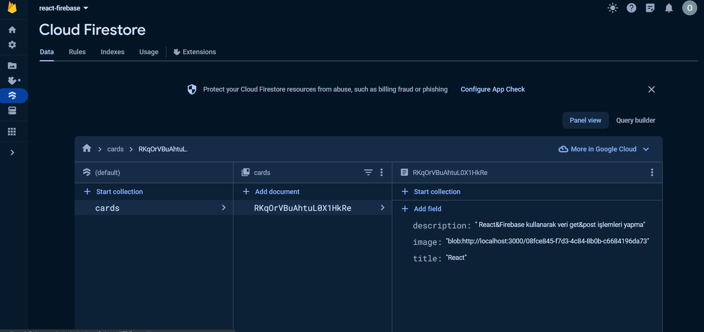

# react-firebase
  Receiving and sending images and data using React & firebase storage
#
  When you fill in the new title&new description and image adding section, the button turns green. 
  By clicking on the button that turns green, we send the entered data to firebase storage. 
  The sent data arrives on the lower card, and the upper card returns to its previous state.
  
# ımages

